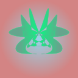
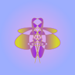

# svgies

Generate unique, deterministic SVG identicons for **Arweave**, **EVM**, **Solana**, and **Bitcoin** blockchain addresses.

<div align="center">

[](https://www.npmjs.com/package/@svgies/icons)
[](https://opensource.org/licenses/MIT)

</div>

## Features

- 🎨 **Unique Identicons** - Generate beautiful, deterministic SVG art from blockchain addresses
- 🌐 **Browser & Node.js** - Works seamlessly in both environments (no Buffer or Node-specific APIs)
- ⛓️ **Multi-Chain Support** - Supports both Arweave and EVM (Ethereum, Polygon, etc.) addresses
- 🔒 **Deterministic** - Same address always generates the same icon
- 🎯 **Customizable** - Adjustable size, optional seed for variations, legacy mode
- 🚀 **Zero Dependencies** - Minimal footprint with only `@noble/hashes` for keccak256
- 💻 **CLI Included** - Command-line tool for quick icon generation
- 📦 **TypeScript** - Full type definitions included

## Visual Examples

See how different addresses are transformed into unique, beautiful identicons:

<table align="center">
  <tr>
    <td align="center">
      <strong>Arweave</strong><br/>
      <code>E_pOZW6MDRtcTraQlIEM0p4l_AedIadAO9j-RzuPol8</code><br/><br/>
      
    </td>
    <td align="center">
      <strong>Bitcoin</strong><br/>
      <code>1A1zP1eP5QGefi2DMPTfTL5SLmv7DivfNa</code><br/><br/>
      
    </td>
  </tr>
  <tr>
    <td align="center">
      <strong>EVM</strong><br/>
      <code>0xA3Ca2a4BFb8Af380cf2D42e40A832E7a205db08e</code><br/><br/>
      
    </td>
    <td align="center">
      <strong>Solana</strong><br/>
      <code>DYw8jCTfwHNRJhhmFcbXvVDTqWMEVFBX6ZKUmG5CNSKK</code><br/><br/>
      
    </td>
  </tr>
</table>

<details>
<summary><strong>Arweave Legacy Mode</strong></summary>
<br/>
<div align="center">
<br/>
<code>E_pOZW6MDRtcTraQlIEM0p4l_AedIadAO9j-RzuPol8 --legacy</code>
</div>
</details>

*Each address generates a deterministic, unique identicon with symmetric patterns and beautiful color gradients.*

**Key Differences:**

| Feature | Arweave | Bitcoin | EVM | Solana |
|---------|---------|---------|-----|--------|
| **Color Source** | SHA-256 hash | Dual SHA-256 | Keccak-256 hash | Dual SHA-256 |
| **Path Source** | First 20 bytes | Dual SHA-256 | Address hex chars | Dual SHA-256 |
| **Algorithm** | SHA-256 + address bytes | Dual-hash approach | Keccak-256 (Ethereum standard) | Dual-hash approach |
| **Uniqueness** | High (hash-based) | Very High (independent hashes) | High (hash-based) | Very High (independent hashes) |
| **Seed Support** | ✅ Yes | ✅ Yes | ❌ No | ✅ Yes |

> 💡 **Tip:** Arweave also supports legacy mode (`--legacy`) for backward compatibility, which derives colors directly from address bytes.

## Installation

```bash
npm install @svgies/icons
```

```bash
pnpm add @svgies/icons
```

```bash
yarn add @svgies/icons
```

## Quick Start

### Programmatic Usage

```typescript
import { svgie, arSvgie, bitcoinSvgie, evmSvgie, solanaSvgie } from '@svgies/icons';

// Auto-detect address type
const svg = await svgie('E_pOZW6MDRtcTraQlIEM0p4l_AedIadAO9j-RzuPol8');

// Chain-specific functions (alphabetically ordered)
const arSvg = await arSvgie('E_pOZW6MDRtcTraQlIEM0p4l_AedIadAO9j-RzuPol8', {
  size: 128,
  asDataURI: true
});

const btcSvg = bitcoinSvgie('1A1zP1eP5QGefi2DMPTfTL5SLmv7DivfNa', {
  size: 64
});

const evmSvg = evmSvgie('0xA3Ca2a4BFb8Af380cf2D42e40A832E7a205db08e', {
  size: 64
});

const solanaSvg = solanaSvgie('DYw8jCTfwHNRJhhmFcbXvVDTqWMEVFBX6ZKUmG5CNSKK', {
  size: 128
});
```

### CLI Usage

```bash
# Install globally
npm install -g @svgies/icons

# Or use with npx
npx @svgies/icons <address> [options]
```

```bash
# Arweave address
svgie E_pOZW6MDRtcTraQlIEM0p4l_AedIadAO9j-RzuPol8

# Bitcoin address
svgie 1A1zP1eP5QGefi2DMPTfTL5SLmv7DivfNa --size 64

# EVM address (Ethereum, Polygon, etc.)
svgie 0xA3Ca2a4BFb8Af380cf2D42e40A832E7a205db08e --size 128

# Solana address
svgie DYw8jCTfwHNRJhhmFcbXvVDTqWMEVFBX6ZKUmG5CNSKK

# Save to file
svgie E_pOZW6MDRtcTraQlIEM0p4l_AedIadAO9j-RzuPol8 -o icon.svg

# Get data URI for embedding
svgie 0xA3Ca2a4BFb8Af380cf2D42e40A832E7a205db08e --data-uri

# Force specific chain type
svgie DYw8jCTfwHNRJhhmFcbXvVDTqWMEVFBX6ZKUmG5CNSKK --chain solana
```

## API Reference

### `svgie(address, options?)`

Auto-detects address type and generates the appropriate SVG icon.

```typescript
async function svgie(
  address: string,
  options?: svgieOptions
): Promise<string | undefined>
```

**Parameters:**
- `address` - Arweave (43 chars) or EVM (0x + 40 hex) address
- `options` - Optional configuration object

**Returns:** SVG string or `undefined` if address is invalid

---

### `arSvgie(address, options?)`

Generate SVG icon specifically for Arweave addresses.

```typescript
async function arSvgie(
  address: string,
  options?: svgieOptions
): Promise<string | undefined>
```

**Parameters:**
- `address` - 43-character Arweave address (base64url format)
- `options` - Optional configuration object

**Returns:** SVG string or `undefined` if address is invalid

**Address Format:** Arweave addresses are 43 characters long and use base64url encoding (a-z, A-Z, 0-9, -, _).

---

### `evmSvgie(address, options?)`

Generate SVG icon specifically for EVM addresses.

```typescript
function evmSvgie(
  address: string,
  options?: svgieOptions
): string | undefined
```

**Parameters:**
- `address` - EVM address (0x + 40 hex characters)
- `options` - Optional configuration object

**Returns:** SVG string or `undefined` if address is invalid

**Address Format:** EVM addresses start with `0x` followed by 40 hexadecimal characters.

---

### Options

```typescript
interface svgieOptions {
  asDataURI?: boolean;  // Return as data URI for HTML embedding
  size?: number;        // SVG size in pixels (default: 32)
  seed?: string;        // Additional seed for variation (Arweave only)
  legacy?: boolean;     // Use legacy color algorithm (Arweave only)
}
```

#### `asDataURI` (default: `false`)

When `true`, returns a data URI string that can be used directly in `` tags or CSS.

```typescript
const dataUri = await arSvgie('vLRHFqCw1uHu75xqB4fCDW-QxpkpJxBtFD9g4QYUbfw', {
  asDataURI: true
});
// Returns: "data:image/svg+xml;utf8,<svg..."

// Use in HTML

```

#### `size` (default: `32`)

Sets the width and height of the SVG in pixels. The viewBox remains `0 0 32 32` for consistency.

```typescript
const smallIcon = await arSvgie(address, { size: 32 });   // 32x32px
const largeIcon = await arSvgie(address, { size: 256 });  // 256x256px
```

#### `seed` (default: `""`) - Arweave only

Adds additional entropy to the color generation, allowing multiple variations for the same address.

```typescript
const default = await arSvgie(address);
const variant1 = await arSvgie(address, { seed: "profile" });
const variant2 = await arSvgie(address, { seed: "banner" });
// All three will have different colors but same paths
```

> **Note:** Seed only affects Arweave addresses. EVM addresses always use keccak256 hash for consistency with the Ethereum ecosystem.

#### `legacy` (default: `false`) - Arweave only

Uses the legacy color calculation method where colors are derived directly from the address bytes instead of a SHA-256 hash.

```typescript
const modern = await arSvgie(address);
const legacy = await arSvgie(address, { legacy: true });
// Different colors, same paths
```

**Why legacy mode?**
- Legacy mode derives colors from the last 24 characters of the address
- This means similar addresses (with similar endings) may have similar colors
- Modern mode (default) uses SHA-256 to ensure unique colors even for similar addresses

---

## CLI Reference

### Installation

```bash
# Global installation
npm install -g @svgies/icons

# Use directly with npx
npx @svgies/icons --help
```

### Command Syntax

```bash
svgie <address> [options]
svgie --address <address> [options]
```

### Options

| Option | Alias | Description | Default |
|--------|-------|-------------|---------|
| `--address <address>` | `-a` | Blockchain address (auto-detected) | - |
| `--size <number>` | `-s` | SVG size in pixels | 32 |
| `--seed <string>` | - | Seed for randomization (Arweave only) | "" |
| `--data-uri` | `-d` | Output as data URI | false |
| `--output <file>` | `-o` | Write to file instead of stdout | - |
| `--legacy` | `-l` | Use legacy colors (Arweave only) | false |
| `--help` | `-h` | Show help message | - |

### Examples

```bash
# Basic usage - outputs SVG to stdout
svgie E_pOZW6MDRtcTraQlIEM0p4l_AedIadAO9j-RzuPol8

# Custom size
svgie E_pOZW6MDRtcTraQlIEM0p4l_AedIadAO9j-RzuPol8 --size 128

# Save to file
svgie E_pOZW6MDRtcTraQlIEM0p4l_AedIadAO9j-RzuPol8 -o avatar.svg

# Data URI for HTML
svgie E_pOZW6MDRtcTraQlIEM0p4l_AedIadAO9j-RzuPol8 --data-uri

# With seed for variation
svgie E_pOZW6MDRtcTraQlIEM0p4l_AedIadAO9j-RzuPol8 --seed "profile-pic"

# Legacy mode (Arweave only)
svgie E_pOZW6MDRtcTraQlIEM0p4l_AedIadAO9j-RzuPol8 --legacy

# Bitcoin address
svgie 1A1zP1eP5QGefi2DMPTfTL5SLmv7DivfNa

# EVM address
svgie 0xA3Ca2a4BFb8Af380cf2D42e40A832E7a205db08e --size 256 -o eth-avatar.svg

# Solana address
svgie DYw8jCTfwHNRJhhmFcbXvVDTqWMEVFBX6ZKUmG5CNSKK
```

---

## Usage Examples

### React Component

```tsx
import { useEffect, useState } from 'react';
import { svgie } from '@svgies/icons';

function AddressAvatar({ address, size = 64 }) {
  const [svg, setSvg] = useState<string>();

  useEffect(() => {
    svgie(address, { size, asDataURI: true }).then(setSvg);
  }, [address, size]);

  if (!svg) return <div>Loading...</div>;

  return ;
}
```

### HTML Embedding

```html
<!-- Direct SVG -->
<div id="avatar"></div>

<script type="module">
  import { evmSvgie } from '@svgies/icons';
  
  const svg = evmSvgie('0x742d35Cc6634C0532925a3b844Bc9e7595f0bEbA', {
    size: 128
  });
  
  document.getElementById('avatar').innerHTML = svg;
</script>
```

### Node.js Script

```javascript
import { arSvgie } from '@svgies/icons';
import { writeFile } from 'fs/promises';

async function generateAvatar(address, filename) {
  const svg = await arSvgie(address, { size: 256 });
  await writeFile(filename, svg, 'utf-8');
  console.log(`Avatar saved to ${filename}`);
}

generateAvatar(
  'vLRHFqCw1uHu75xqB4fCDW-QxpkpJxBtFD9g4QYUbfw',
  'avatar.svg'
);
```

### Express.js Endpoint

```javascript
import express from 'express';
import { svgie } from '@svgies/icons';

const app = express();

app.get('/avatar/:address', async (req, res) => {
  const { address } = req.params;
  const size = parseInt(req.query.size) || 128;
  
  const svg = await svgie(address, { size });
  
  if (!svg) {
    return res.status(400).json({ error: 'Invalid address' });
  }
  
  res.setHeader('Content-Type', 'image/svg+xml');
  res.setHeader('Cache-Control', 'public, max-age=31536000'); // 1 year
  res.send(svg);
});

app.listen(3000);
```

### Batch Generation

```javascript
import { svgie } from '@svgies/icons';
import { writeFile } from 'fs/promises';

const addresses = [
  'vLRHFqCw1uHu75xqB4fCDW-QxpkpJxBtFD9g4QYUbfw',
  '0x742d35Cc6634C0532925a3b844Bc9e7595f0bEbA',
  // ... more addresses
];

async function generateBatch() {
  for (const address of addresses) {
    const svg = await svgie(address, { size: 256 });
    const filename = `${address.substring(0, 8)}.svg`;
    await writeFile(`./avatars/${filename}`, svg);
  }
}

generateBatch();
```

---

## How It Works

### Arweave Addresses

1. **Address Decoding**: Base64url → bytes
2. **Color Generation**: SHA-256 hash of address → RGBA colors with opacity adjustment
3. **Path Generation**: First 20 bytes → control points for Bézier curves
4. **SVG Assembly**: Combines colors and paths into a symmetric SVG design

**Color Algorithm (Modern):**
- Computes SHA-256 hash of the address
- Splits hash into 4-byte chunks (8 colors)
- Applies opacity transformation: `(value >> 2) + 191`
- Ensures minimum 75% opacity for visibility

**Color Algorithm (Legacy):**
- Uses last 24 hex characters directly from address
- May produce similar colors for addresses with similar endings

### EVM Addresses

1. **Address Processing**: Lowercase → UTF-8 bytes
2. **Color Generation**: Keccak-256 hash → RGBA colors with opacity adjustment
3. **Path Generation**: 40 hex characters → control points for Bézier curves
4. **SVG Assembly**: Same symmetric design as Arweave icons

**Why Keccak-256 for EVM?**
- Keccak-256 is the standard hash function in the Ethereum ecosystem
- Ensures consistency with Ethereum's address checksum algorithm
- Produces colors that are deterministic and unique to each address

### SVG Design

The generated SVG uses:
- **Radial gradient** (top layer, 50% opacity)
- **Linear gradients** (mirror pattern)
- **Bézier curves** (symmetric left-right design)
- **32×32 viewBox** (scales to any size)

---

## Browser Compatibility

Works in all modern browsers and Node.js environments:

- ✅ Chrome/Edge 88+
- ✅ Firefox 90+
- ✅ Safari 14+
- ✅ Node.js 16+

**Key Features:**
- Uses native `atob()` for base64 decoding (with fallback)
- Uses native `crypto.subtle` for SHA-256
- Uses `@noble/hashes` for Keccak-256 (browser-compatible)
- No Buffer or Node-specific APIs

---

## TypeScript Support

Full TypeScript definitions are included:

```typescript
import type { svgieOptions } from '@svgies/icons';

const options: svgieOptions = {
  size: 128,
  asDataURI: true,
  seed: 'variation-1',
  legacy: false
};
```

---

## Performance

- ⚡ **Fast**: Generates icons in <5ms (Node.js) or <10ms (browser)
- 💾 **Lightweight**: ~8KB minified + gzipped
- 🎯 **Efficient**: No external API calls, all computation is local

---

## Supported Address Formats

### Arweave
- **Length**: 43 characters
- **Format**: Base64url (a-z, A-Z, 0-9, -, _)
- **Example**: `E_pOZW6MDRtcTraQlIEM0p4l_AedIadAO9j-RzuPol8`

### EVM (Ethereum, Polygon, Arbitrum, etc.)
- **Length**: 42 characters (0x + 40 hex)
- **Format**: 0x prefix + hexadecimal (0-9, a-f, A-F)
- **Example**: `0xA3Ca2a4BFb8Af380cf2D42e40A832E7a205db08e`

### Solana
- **Length**: 32-44 characters (typically 44)
- **Format**: Base58 (excludes 0, O, I, l for readability)
- **Example**: `DYw8jCTfwHNRJhhmFcbXvVDTqWMEVFBX6ZKUmG5CNSKK`

### Bitcoin
- **Length**: 26-62 characters
- **Format**: Base58 (Legacy: starts with 1 or 3) or Bech32 (SegWit: starts with bc1)
- **Examples**: 
  - Legacy: `1A1zP1eP5QGefi2DMPTfTL5SLmv7DivfNa`
  - Bech32: `bc1qxy2kgdygjrsqtzq2n0yrf2493p83kkfjhx0wlh`

---

## FAQ

### Why are icons deterministic?

Each address always produces the same icon because we use cryptographic hash functions (SHA-256 for Arweave, Keccak-256 for EVM) to derive colors from the address. This ensures:
- ✅ Same icon across different devices/sessions
- ✅ Users can recognize addresses visually
- ✅ No storage or database needed

### Can two addresses have the same icon?

Practically impossible. With 2^256 possible combinations for colors and paths, the chance of collision is astronomically low (similar to hash collision probability).

### Why does EVM use Keccak-256 instead of SHA-256?

Keccak-256 is the native hash function used throughout the Ethereum ecosystem. Using it ensures consistency with Ethereum's own address derivation and checksum algorithms.

### What's the difference between modern and legacy mode?

- **Modern (default)**: Colors from SHA-256 hash → unique colors even for similar addresses
- **Legacy**: Colors from address bytes → similar addresses may have similar colors

Legacy mode is provided for backward compatibility with earlier implementations.

### Can I use this for non-blockchain addresses?

While designed for blockchain addresses, you can use it with any string that matches the format:
- 43-character alphanumeric strings for Arweave mode
- 42-character hex strings (with 0x prefix) for EVM mode

---

## Contributing

Contributions are welcome! Please feel free to submit a Pull Request.

---

## License

MIT © [7i7o](https://github.com/7i7o)

---

## Links

- **GitHub**: [github.com/svgies/icons](https://github.com/svgies/icons)
- **npm**: [@svgies/icons](https://www.npmjs.com/package/@svgies/icons)
- **Issues**: [Report a bug](https://github.com/svgies/icons/issues)

---

## Acknowledgments

Inspired by the need for beautiful, deterministic visual representations of blockchain addresses in decentralized applications.
